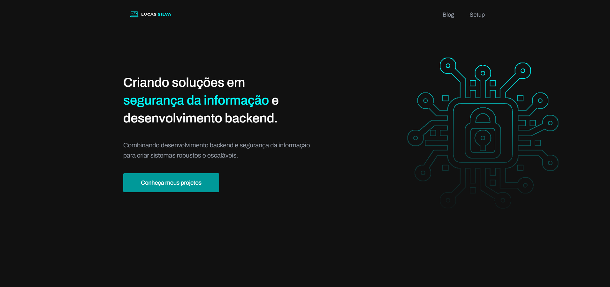

<!-- 
$$$$$$$\                                $$\                                     $$\       $$\
$$  __$$\                               $$ |                                    $$ |      $$ |
$$ |  $$ | $$$$$$\ $$\    $$\  $$$$$$\  $$ | $$$$$$\   $$$$$$\   $$$$$$\   $$$$$$$ |      $$$$$$$\  $$\   $$\
$$ |  $$ |$$  __$$\\$$\  $$  |$$  __$$\ $$ |$$  __$$\ $$  __$$\ $$  __$$\ $$  __$$ |      $$  __$$\ $$ |  $$ |
$$ |  $$ |$$$$$$$$ |\$$\$$  / $$$$$$$$ |$$ |$$ /  $$ |$$ /  $$ |$$$$$$$$ |$$ /  $$ |      $$ |  $$ |$$ |  $$ |
$$ |  $$ |$$   ____| \$$$  /  $$   ____|$$ |$$ |  $$ |$$ |  $$ |$$   ____|$$ |  $$ |      $$ |  $$ |$$ |  $$ |
$$$$$$$  |\$$$$$$$\   \$  /   \$$$$$$$\ $$ |\$$$$$$  |$$$$$$$  |\$$$$$$$\ \$$$$$$$ |      $$$$$$$  |\$$$$$$$ |
\_______/  \_______|   \_/     \_______|\__| \______/ $$  ____/  \_______| \_______|      \_______/  \____$$ |
                                                          $$ |                                          $$\   $$ |
                                                          $$ |                                          \$$$$$$  |
                                                          \__|                                           \______/
$$\                                                   $$\                                                          $$\                  $$$$$$\  $$\ $$\
$$ |                                                  $$ |                                                         $$ |                $$  __$$\ \__|$$ |
$$ |     $$\   $$\  $$$$$$$\ $$$$$$\   $$$$$$$\       $$ |      $$$$$$\   $$$$$$\   $$$$$$\   $$$$$$$\        $$$$$$$ | $$$$$$\        $$ /  \__|$$\ $$ |$$\    $$\ $$$$$$\
$$ |     $$ |  $$ |$$  _____|\____$$\ $$  _____|      $$ |     $$  __$$\ $$  __$$\ $$  __$$\ $$  _____|      $$  __$$ | \____$$\       \$$$$$$\  $$ |$$ |\$$\  $$  |\____$$\
$$ |     $$ |  $$ |$$ /      $$$$$$$ |\$$$$$$\        $$ |     $$ /  $$ |$$ /  $$ |$$$$$$$$ |\$$$$$$\        $$ /  $$ | $$$$$$$ |       \____$$\ $$ |$$ | \$$\$$  / $$$$$$$ |
$$ |     $$ |  $$ |$$ |     $$  __$$ | \____$$\       $$ |     $$ |  $$ |$$ |  $$ |$$   ____| \____$$\       $$ |  $$ |$$  __$$ |      $$\   $$ |$$ |$$ |  \$$$  / $$  __$$ |
$$$$$$$$\\$$$$$$  |\$$$$$$$\\$$$$$$$ |$$$$$$$  |      $$$$$$$$\\$$$$$$  |$$$$$$$  |\$$$$$$$\ $$$$$$$  |      \$$$$$$$ |\$$$$$$$ |      \$$$$$$  |$$ |$$ |   \$  /  \$$$$$$$ |
\________|\______/  \_______|\_______|\_______/       \________|\______/ $$  ____/  \_______|\_______/        \_______| \_______|       \______/ \__|\__|    \_/    \_______|
                                                                             $$ |
                                                                             $$ |
                                                                             \__|
-->

<h1 align="center">
  Portfólio Profissional de Lucas Silva 
</h1>

  
  
  

 

  

 

## 📝 Descrição 

Bem-vindo ao meu portfólio profissional! Este projeto é uma representação digital das minhas habilidades, experiências e projetos na área de **Segurança da Informação** e **Desenvolvimento Backend**. Aqui, você encontrará informações sobre minha trajetória, projetos realizados e conhecimentos adquiridos ao longo da minha jornada como **Ethical Hacker** e **Penetration Tester**.

## 🚀 Funcionalidades Desenvolvidas

### 1. Estrutura Responsiva e Moderna

- **Design Responsivo**: Layout que se adapta a diferentes dispositivos, garantindo uma experiência consistente em desktops, tablets e smartphones.
- **Interface Intuitiva**: Navegação simples e direta, facilitando o acesso às informações mais relevantes.

### 2. Seções Detalhadas

- **Sobre Mim**: Apresentação pessoal, incluindo formação, interesses e objetivos profissionais.
- **Experiências**: Detalhamento das experiências profissionais, destacando minhas atuações na área de TI e Segurança da Informação.
- **Projetos**: Galeria de projetos desenvolvidos, com descrição, tecnologias utilizadas e links para repositórios ou demonstrações.
- **Conhecimentos**: Lista das principais ferramentas e tecnologias com as quais tenho proficiência, como Python, Kali Linux, Nmap, entre outros.

### 3. Interatividade e Animações

- **Animações Suaves**: Transições e efeitos visuais que enriquecem a experiência do usuário sem comprometer a performance.
- **Efeitos de Hover**: Interações que fornecem feedback visual ao usuário ao interagir com elementos da página.

### 4. Otimizações de Performance e SEO

- **Código Otimizado**: Utilização de boas práticas de desenvolvimento para garantir carregamento rápido e eficiente.
- **SEO Implementado**: Meta tags e estruturação adequada para melhorar a visibilidade em motores de busca.

## 📚 Tecnologias e Ferramentas Utilizadas

- **Front-end**:
  - HTML5
  - CSS3 / SCSS
  - JavaScript ES6+
- **Frameworks e Bibliotecas**:
  - ScrollReveal.js (para animações ao rolar a página)
- **Ferramentas de Desenvolvimento**:
  - Visual Studio Code
  - Git e GitHub (controle de versão)

## 💡 Aprendizados e Melhorias

- **Modularização de Código**: Aprimoramento na organização do código utilizando módulos ES6, facilitando a manutenção e escalabilidade.
- **Acessibilidade**: Implementação de práticas que melhoram a acessibilidade, como uso correto de tags semânticas e textos alternativos em imagens.
- **Responsividade**: Desenvolvimento mobile-first, garantindo que o site seja acessível em diferentes dispositivos e resoluções.
- **Otimização de Performance**: Minificação de arquivos CSS e JavaScript e otimização de imagens para um carregamento mais rápido.

## 🔗 Links

 
  
 

 

 
## 💻 Autor

<table>
  <tr>
    <td align="center">
      <a href="https://www.linkedin.com/in/lucaslopesdasilva/">
         
        
          <b>Lucas Silva</b>
        
      </a>
    </td>
  </tr>
</table>

-----

<h3 align="center"> Desenvolvido por <a href="https://www.linkedin.com/in/lucaslopesdasilva/">Lucas Silva</a> ☕</h3>