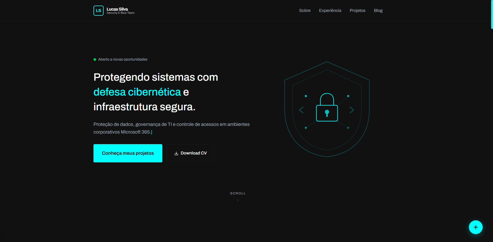

<div align="center">


# Lucas Silva

**Segurança da Informação // Blue Team // IAM // DLP**

[](https://nextjs.org)
[](https://www.typescriptlang.org)
[](https://tailwindcss.com)
[](https://www.framer.com/motion/)
[](https://vercel.com)
[](#performance)

[Ver ao Vivo](https://portfolio-lucaslopes.vercel.app) · [LinkedIn](https://www.linkedin.com/in/lucaslopesdasilva/) · [GitHub](https://github.com/eoLucasS)

</div>

---

## Sobre

Meu portfolio profissional. Atuo na área de Segurança da Informação com foco em Blue Team, proteção de dados, IAM, DLP e governança de TI em ambientes corporativos Microsoft 365.

Decidi reconstruir do zero o portfolio anterior (que era HTML/CSS/JS puro) usando uma stack moderna, aproveitando para aplicar na prática conceitos de desenvolvimento seguro, performance e boas práticas de SEO que uso no dia a dia.

> [!NOTE]
> Rework completo usando Next.js 16 (App Router), TypeScript strict, Tailwind CSS 4 e Framer Motion.

---

## Preview

<div align="center">
  
</div>

---

## Funcionalidades

<details>
<summary><strong>Seções da Landing Page</strong></summary>

| Seção | Descrição |
|-------|-----------|
| **Hero** | Badge de disponibilidade, typewriter animado, download de CV, SVG animado com Framer Motion |
| **Sobre** | Foto, bio, links sociais, formação acadêmica |
| **Stats** | Contadores animados (tenants M365, endpoints, políticas, etc.) |
| **Experiências** | Sidebar interativa com seletor de cargo e descrições detalhadas |
| **Formação e Certificações** | Cards de destaque para formação acadêmica + grid de certificações com badges |
| **Projetos** | Grid responsivo com cards coloridos por projeto, tags e link para GitHub |
| **Segurança da Informação** | Tríade CIA (Confidencialidade, Integridade, Disponibilidade) |
| **Conhecimentos** | Grid de 12 skills com hover interativo e descrição dinâmica |
| **Como Trabalho** | Metodologia em 4 etapas: Mapeamento, Implementação, Monitoramento, Documentação |
| **Depoimentos** | Recomendações reais do LinkedIn com citações e dados dos autores |
| **CTA de Contato** | Call-to-action com e-mail e LinkedIn |

</details>

<details>
<summary><strong>Blog</strong></summary>

- Posts escritos em Markdown com frontmatter (título, data, tags, excerpt, tempo de leitura)
- Renderização via `remark` + `remark-html`
- Listagem com cards, tags e excerpt
- Página individual com breadcrumb, autor, share (LinkedIn/X) e posts relacionados
- JSON-LD `BlogPosting` + `BreadcrumbList` por post
- Navbar contextual (muda links quando está no blog)

</details>

<details>
<summary><strong>SEO e Social Sharing</strong></summary>

- Meta tags completas: `og:title`, `og:description`, `og:image`, `og:locale`, `twitter:card`, `twitter:images`
- OG Image dinâmica via API Route (`/api/og`) com `@vercel/og` (Edge Runtime)
- JSON-LD `Person` na home (com `@id`, `alumniOf`, `knowsAbout`, `image`, `email`)
- JSON-LD `BlogPosting` + `BreadcrumbList` em cada post
- Canonical URLs em todas as páginas
- Sitemap dinâmico com `changeFrequency` e `priority`
- `robots.txt` com bloqueio de `/docs/`, `/api/` e crawlers de IA (GPTBot, CCBot)

</details>

<details>
<summary><strong>Segurança</strong></summary>

| Header | Proteção |
|--------|----------|
| `Content-Security-Policy` | XSS, injection, clickjacking (`frame-ancestors 'none'`) |
| `Strict-Transport-Security` | Downgrade HTTPS para HTTP (HSTS preload) |
| `X-Frame-Options: DENY` | Clickjacking |
| `X-Content-Type-Options: nosniff` | MIME sniffing |
| `Referrer-Policy` | Leak de referrer |
| `Permissions-Policy` | Abuso de camera, microfone, geolocation |
| `X-Permitted-Cross-Domain-Policies: none` | Flash/PDF cross-domain |
| `Content-Disposition: attachment` (docs) | Renderização inline de PDF |

- CSP dinâmica: `'unsafe-eval'` apenas em desenvolvimento (React DevTools), removido em produção
- CV servido com download forçado + `X-Robots-Tag: noindex`
- Input sanitization na API de OG Image (previne injection)
- Bloqueio de crawlers de IA (GPTBot, ChatGPT-User, CCBot) no robots.txt

</details>

<details>
<summary><strong>UI/UX e Animações</strong></summary>

- Scroll Reveal com Framer Motion (`whileInView`, `viewport: once`)
- Typewriter com cursor piscante em CSS puro
- SVG do Hero com path draw animation sequencial + circuit dots pulsantes
- Stats counter com incremento animado ao entrar na viewport
- Hover effects: `translateY`, border color, box-shadow em todos os cards
- Mobile menu fullscreen com slide staggered
- Indicador de scroll animado no Hero
- FloatingCTA com popup de contato (fecha por click outside, Escape ou botão)
- Design dark-only com accent cyan (#00FFFF)
- Scrollbar customizada, selection cyan, smooth scroll

</details>

---

## Stack

| Camada | Tecnologia |
|--------|-----------|
| Framework | [Next.js 16](https://nextjs.org) (App Router, SSG) |
| Linguagem | [TypeScript](https://www.typescriptlang.org) (strict) |
| Estilização | [Tailwind CSS v4](https://tailwindcss.com) |
| Animações | [Framer Motion](https://www.framer.com/motion/) |
| Blog | Markdown + [gray-matter](https://github.com/jonschlinkert/gray-matter) + [remark](https://github.com/remarkjs/remark) |
| OG Images | [@vercel/og](https://vercel.com/docs/functions/og-image-generation) (Edge Runtime) |
| Font | [Archivo](https://fonts.google.com/specimen/Archivo) via `next/font` |
| Deploy | [Vercel](https://vercel.com) |

---

## Quick Start

> [!TIP]
> Pré-requisito: [Node.js](https://nodejs.org) 18 ou superior.

```bash
# Clone o repositório
git clone https://github.com/eoLucasS/portfoliov2.git

# Instale as dependências
cd portfoliov2 && npm install

# Inicie o servidor de desenvolvimento
npm run dev
```

Abra [http://localhost:3000](http://localhost:3000).

---

## Estrutura

<details>
<summary><strong>Ver árvore de arquivos</strong></summary>

```
src/
├── app/
│   ├── api/og/route.tsx          # OG Image dinâmica (Edge Runtime)
│   ├── blog/
│   │   ├── page.tsx              # Listagem de posts
│   │   └── [slug]/page.tsx       # Post individual
│   ├── layout.tsx                # Root layout (metadata, fonts, header/footer)
│   ├── page.tsx                  # Home (todas as seções)
│   ├── not-found.tsx             # Página 404
│   └── sitemap.ts                # Sitemap dinâmico
├── components/
│   ├── Header.tsx                # Header fixo com nav contextual
│   ├── Footer.tsx                # Footer com copyright dinâmico
│   ├── MobileMenu.tsx            # Menu mobile fullscreen
│   ├── FloatingCTA.tsx           # Botão flutuante de contato
│   ├── ScrollReveal.tsx          # Wrapper Framer Motion
│   ├── TypeWriter.tsx            # Efeito de digitação
│   └── sections/
│       ├── Hero.tsx              # Hero com badge, CV, scroll indicator
│       ├── About.tsx             # Sobre com foto e bio
│       ├── Stats.tsx             # Contadores animados
│       ├── Experience.tsx        # Experiências com sidebar
│       ├── Certifications.tsx    # Formação + certificações
│       ├── Projects.tsx          # Grid de projetos
│       ├── Security.tsx          # Tríade CIA
│       ├── Skills.tsx            # Grid de conhecimentos
│       ├── Methodology.tsx       # Como trabalho (4 steps)
│       ├── Testimonials.tsx      # Depoimentos do LinkedIn
│       └── ContactCTA.tsx        # CTA de contato
├── content/posts/                # Artigos do blog em Markdown
├── lib/
│   ├── constants.ts              # Dados centralizados
│   └── posts.ts                  # Parser de Markdown
└── styles/
    └── globals.css               # Tailwind + scrollbar + prose
```

</details>

---

## Performance

O site é otimizado para Core Web Vitals:

- **SSG** (Static Site Generation) para todas as páginas
- **Font otimizada** via `next/font` com `display: swap`
- **Imagens** servidas com `next/image` (lazy loading, otimização automática)
- **Cache agressivo** na API de OG Image (24h + stale-while-revalidate)
- **Zero JavaScript desnecessário** em componentes server-side

---

## Licença

Este projeto é de uso pessoal. O código fonte está disponível para referência e aprendizado.

---

<div align="center">

Feito por [Lucas Silva](https://www.linkedin.com/in/lucaslopesdasilva/)

</div>
